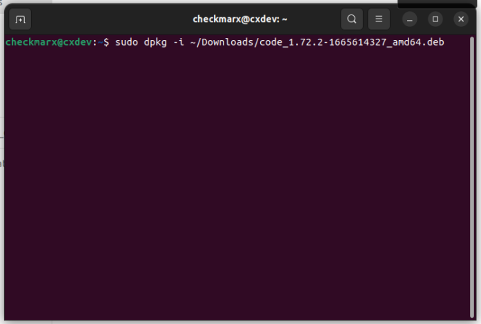
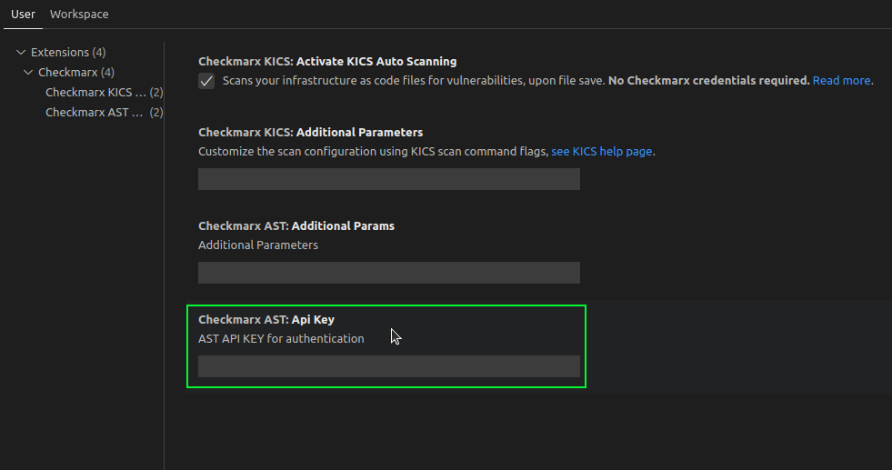
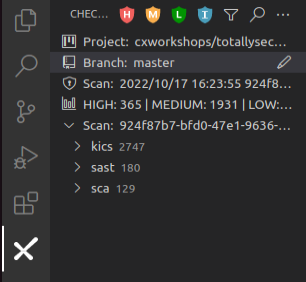
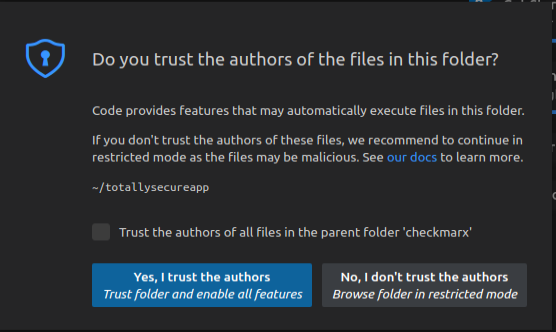
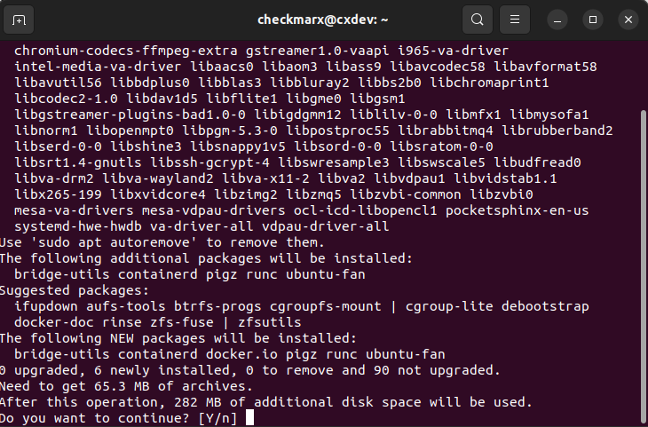

# Lab 1: Environment Setup

## Introduction
In this lab, we will focus on configuring our environment using an IDE and the Checkmarx plugin.  While Checkmarx supports multiple IDEs, for these labs we will be leverage Microsoft Visual Studio Code, as it is free and commonly used.  Checkmarx has integrated plugins with the following IDEs:

* Eclipse
* IntelliJ
* Visual Studio
* VS Code

To learn more, checkout [Checkmarx Integrations with Popular IDEs](https://checkmarx.com/why-checkmarx/integrations/checkmarx-integrations-with-ides/)

{: .warning }
For these labs, we are using a known vulnerable Java project based heavily on [EasyBuggy](https://github.com/k-tamura/easybuggy) to demonstrate vulnerability detection and remediation capabilities.  Note that if this application is run, this Java application can result in system crashes as a result of memory leaks, deadlock, JVM crashes, etc.  In these labs, we are only using Checkmarx solutions that scan source code, thus there is no reason or need to run this project and __it is not recommended to do so__. If you do wish to run the project, do so at your own risk. It is HIGHLY recommended you do so in a sandbox environment (e.g. within a VM)

## Install VS Code
The first step is to install VS Code, if you don't already have it installed.

{: .note }
If you already have VS Code installed, you can skip this section. When we are done with the lab, you can always uninstall/disable the Checkmarx plugin

1. Navigate to [https://code.visualstudio.com/download](https://code.visualstudio.com/download) to download the Visual Studio Code installer for your operating system.
2. Install VS Code on your machine

## Install the Checkmarx Plugin
Once VS Code is installed, we need to install the Checkmarx plugin. The Visual Studio Code Extension is available on the [Visual Studio Code marketplace](https://marketplace.visualstudio.com/items?itemName=checkmarx.ast-results). You can initiate the installation directly from the Visual Studio Code console.

1. Open VS Code
2. Within VS Code, click the Extensions Icon
3. Type "Checkmarx" in the search prompt, then click __Install__ for that extension
    

    {: .note }
    Ensure you select the Plugin entitled "Checkmarx," not Checkmarx SAST x.x

4. The Checkmarx extension is installed and the Checkmarx icon appears in the left-side navigation panel

    

## Configure the Checkmarx Plugin
1. In the VS Code console, click on the Checkmarx extension icon and then click on the Open settings button.
The Checkmarx Settings form opens.
    

2. In the Checkmarx AST plugin section, enter the following details:

    |         Item                 |          Value                |
    |:----------------------       |:-----------------------       |
    | Checkmarx AST: Api Key       | \<provided by proctor\>       |
    | Checkmarx AST: Base Auth Uri | https://deu.iam.checkmarx.net |
    | Checkmarx AST: Base Uri      | https://deu.ast.checkmarx.net |
    | Checkmarx AST: Tenant        | devworkshop-canary            |

3. Once entered, the Checkmarx plugin will authenticate to the Checkmarx One tenant

## Connect to a project

1. Mouse-over the __Project:__ field in the left pane, click the pencil icon, then select the project name __cxworkshops/totallysecureapp__ that appears in the middle search bar

    

2. Mouse-over the __Branch:__ field in the left pane, click the pencil icon, then select the branch __master__ that appears in the middle search bar

    

3. The Checkmarx Plugin is now configured and you should see scan results appear in the left pane

    

## Clone the project to your local machine
1. Clone our example scanned project to your local machine.

        git clone https://github.com/cxworkshops/totallysecureapp.git

    {: .note }
    You will need __git__ installed on your local machine if it is not already installed. You can use [this guide ](https://github.com/git-guides/install-git) to see the steps for your operating system

2. Within VS Code, select File > Open Folder, and select the directory totallysecureapp.

3.  You may be prompted by VS Code asking if you trust the developers. We will not be executing any of this projects code and will just be reviewing the source, so you can safely accept. Once you complete the labs, you can safely delete the project.

    '

## (Optional) Install Docker on your local machine

{: .note }
Docker is required to be installed on your local machine if you wish to use the Checkmarx Infrastructure-as-code (IaC)/KICS autoremediation feature. 

### Windows / Mac Users

The easiest way to get Docker installed on a Windows or Mac machine is to do so with [Docker Desktop](https://www.docker.com/products/docker-desktop/).

{: .note }
Prior to installing Docker Desktop on your local machine, ensure you adhere to [Docker's Subscription and Licensing terms](https://www.docker.com/pricing/faq/).

1. In this example, we will be installing docker on our Ubuntu Linux machine.  Use the following command to install docker:

        sudo apt install docker.io

    

2. Review the install requirements and dependent packages and type 'y' when ready

3. If you are running on Linux, you will need to ensure that your user can manage docker as non-root.  The easiest way to do this is to add your user to the docker group:

        sudo gpasswd -a $USER docker

## Key Takeaways
- Checkmarx has IDE plugins for all major IDEs
- The Checkmarx One VS Code plugin is available within the Visual Studio Marketplace and is distinct from the Checkmarx SAST plugin
- The Checkmarx One VS Code plugin can be connected to a Checkmarx One instance by configuring four fields
- Checkmarx Scan results can be reviewed all within the IDE
- Docker is required for IaC/KICS autoremediation within VS Code