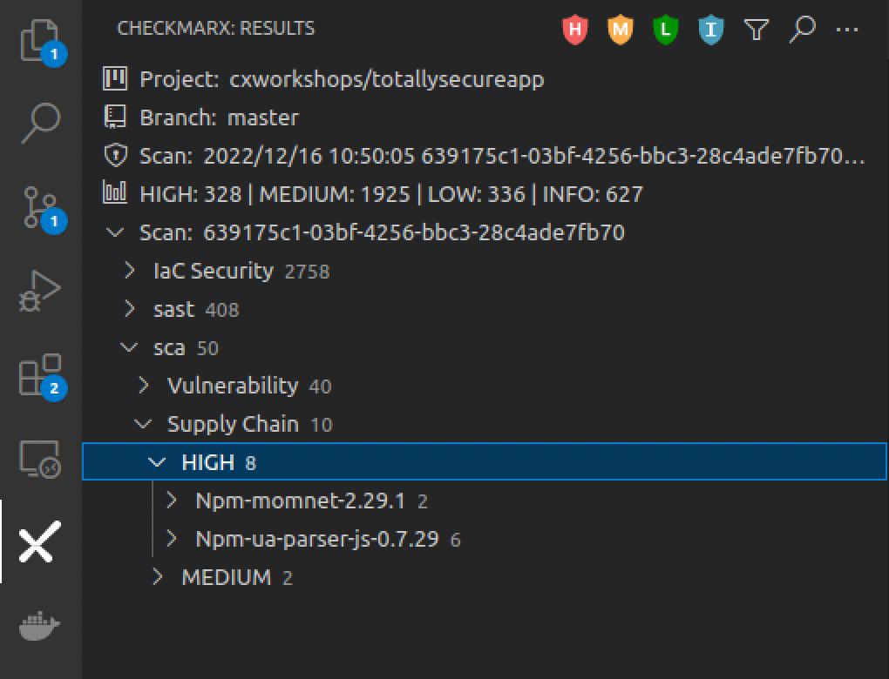
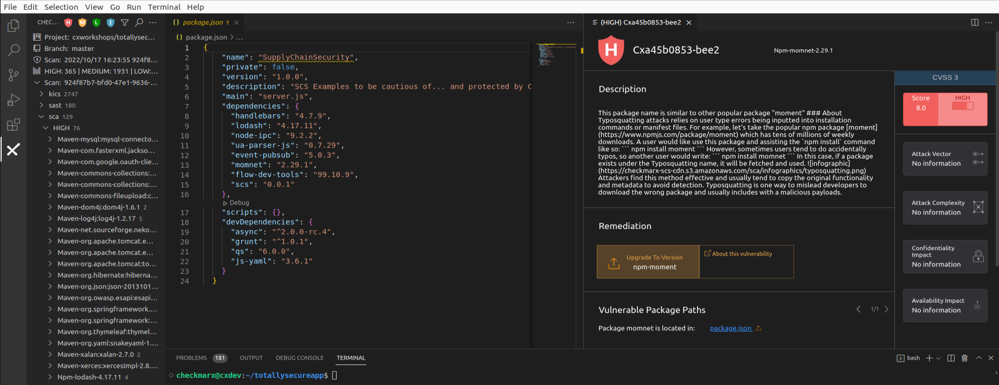
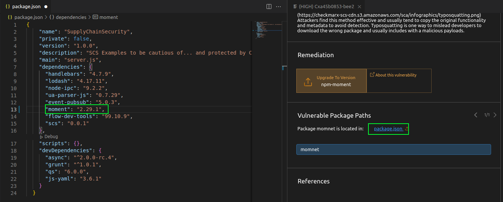
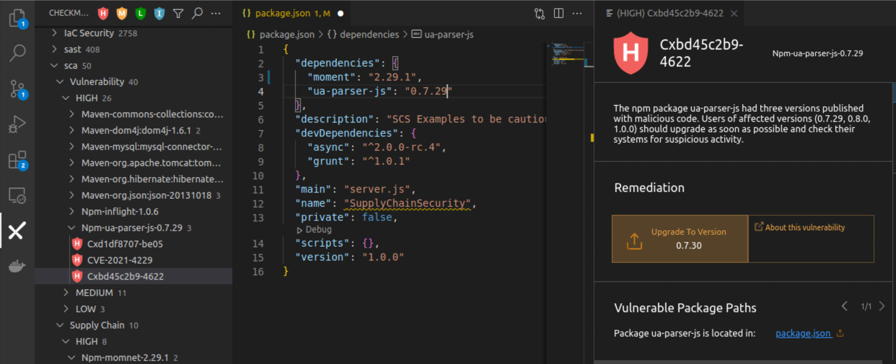

# Lab 1: Malicious Package Detection
In this lab, we will explore some examples of Software Supply Chain (SCS) findings, and how to remediate them. 

{: .important-title }
> Prerequisites
>
> We will be using our __totallysecureapp__ project, which is available at https://github.com/cxworkshops/totallysecureapp. If you have not already done so, clone the project to your local machine, as defined in [Lab 1](../lab1_setup/).

{: .note }
While we are reviewing malicious packages in this lab, we won't be executing any of the project code (and for that matter, even if you did run the project, the malicious packages aren't actually used within the project), so there is no risk of introducing malicious packages into your system.

## Introduction
A good developer is an efficient developer and part of being an efficient developer is not re-inventing the wheel for every project or solution.  As a result, many of us leverage the benefits of freely available open source software and/or packages to save time and effort and let us achieve our functionality and features faster. And while these open source solutions save significant time, effort, and headaches, importing others’ code into our projects exposes us to potential risks and vulnerabilities we otherwise wouldn't face if we developed all of our code ourselves.

## Reviewing SCS Results
SCS results are included in the Checkmarx SCA scan engine.  Within the Checkmarx VS Code plugin, ensure you are connected to the project, branch, and scan result as noted in the __Connect to a project__ section in [Lab 1](../lab1_setup/).

### TypoSquatting

1. Navigate to the Checkmarx Plugin in the left menu of VS Code, expand sca > Malicious Package > HIGH results

    

2. Expand the Npm-momnet-2.29.1 result, and select the __Cxa45b0853-bee2__ result. Note how a new pane opens at the far right with a description of the malicious package.

    

    {: .note }
    > Note that to date, unlike vulnerabilities where we have a common standard of CVE, there is no standardized universal ID for malicious packages. For example, IDs of the same incident:
    >
    > - cx-2021-b8833-be2146 (Checkmarx)
    > - SNYK-JS-RC-1911120 (Snyk)
    > - sonatype-2021-1696 (Sonatype)
    > - GHSA-g2q5-5433-rhrf (GitHub)

3. Per the malicious package description, we can see this is a malicious package and is using the __Typo Squatting__ attack.  The package creators are hoping that a developer mistypes "moment" and accidentally imports their package instead, which includes a malicious method that deletes the inner HTML body and crashes the app.  We can fix this malicious package by clicking on the Vulnerable package path which links to package.json and changing the package name from __momnet__ to __moment__:

    

### RepoJacking

1. Within the Checkmarx Plugin, under the sca > Vulnerability > HIGH results, expand the __Npm-ua-parser-js-0.7.29__ result and select __Cxbd45c2b9-4622__

    

2. Reviewing the malicious package description, we can see that ua-parser-js had three versions published with malicious code.  The three affected versions (0.7.29, 0.8.0, and 1.0.0) were the result of an account takeover, otherwise known as __Repojacking__.  We can see in the remediation advice that we can upgrade to version 0.7.30 to ensure we are not importing an affected version.

3. Click on "Upgrade to Version," and the Checkmarx plugin will automatically update our package version within package.json to 0.7.30

    

## Key Takeaways

- Supply Chain Security (SCS) results are included in Checkmarx SCA results
- Unlike vulnerabilities where we have CVEs, malicious packages don't have a standardized identifier
- Supply Chain Attacks can be surprisingly unsophisticated, but easily incorporated
- The Checkmarx VS Code plugin allows for auto-remediation of specific package versions
